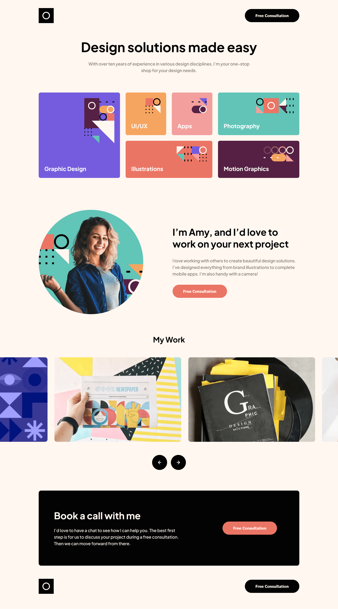
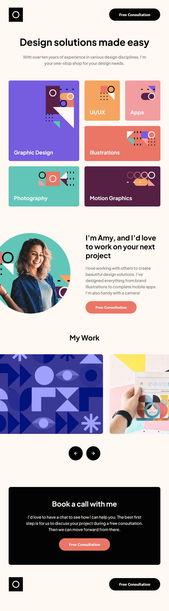

# Frontend Mentor - Single-page design portfolio solution

This is a solution to the [Single-page design portfolio challenge on Frontend Mentor](https://www.frontendmentor.io/challenges/singlepage-design-portfolio-2MMhyhfKVo). Frontend Mentor challenges help you improve your coding skills by building realistic projects.

## Table of contents

- [Overview](#overview)
  - [The challenge](#the-challenge)
  - [Screenshots](#screenshots)
  - [Links](#links)
- [My process](#my-process)
  - [Built with](#built-with)
  - [What I learned](#what-i-learned)
  - [Useful resources](#useful-resources)
- [Author](#author)

## Overview

### The challenge

Users should be able to:

- View the optimal layout for the site depending on their device's screen size
- See hover states for all interactive elements on the page
- Navigate the slider using either the mouse/trackpad or keyboard

### Screenshots

Desktop

---

Tablet

---

Mobile

### Links

- Solution URL: [https://github.com/mihalymarcell86/single-page-design-portfolio](https://github.com/mihalymarcell86/single-page-design-portfolio)
- Live Site URL: [https://mihalymarcell86.github.io/single-page-design-portfolio/](https://mihalymarcell86.github.io/single-page-design-portfolio/)

## My process

### Built with

- Semantic HTML5 markup
- Sass, BEM
- Vanilla JavaScript
- Mobile-first workflow

### What I learned

I made the carousel infinite, so that when a certain scroll position is reached, the JS code rearranges the array of children the container element has.

At the moment, the carousel can be scrolled via trackpad, the arrow buttons on the keyboard when the carousel is in focus and the button controls below the container. The events fired by these controls would clash, so I had to make sure that only one control is active at a time. I used throttling to make sure, that the button controls don't dispatch too many events simultaneously.

I had to do some research to find out how to remove a scrollbar from an element while leaving it's content scrollable. There are differences between browsers. The `::-webkit-scrollbar` pseudo-class works fine with most broswers, for Firefox `scrollbar-width: none` does the job.

I was suprised to learn, that there is no way to acces the `gap` property from JS. Even though it exists as `Element.style.gap`, it doesn't return the actual value.

Another interesting difference in browsers was the `scrollLeftMax` (maximum scroll position) property, which is only known by Firefox.

### Useful resources

- [Example resource 1](https://www.example.com) - This helped me for XYZ reason. I really liked this pattern and will use it going forward.
- [Example resource 2](https://www.example.com) - This is an amazing article which helped me finally understand XYZ. I'd recommend it to anyone still learning this concept.

## Author

- GitHub - [mihalymarcell86](https://github.com/mihalymarcell86)
- Frontend Mentor - [@mihalymarcell86](https://www.frontendmentor.io/profile/mihalymarcell86)
